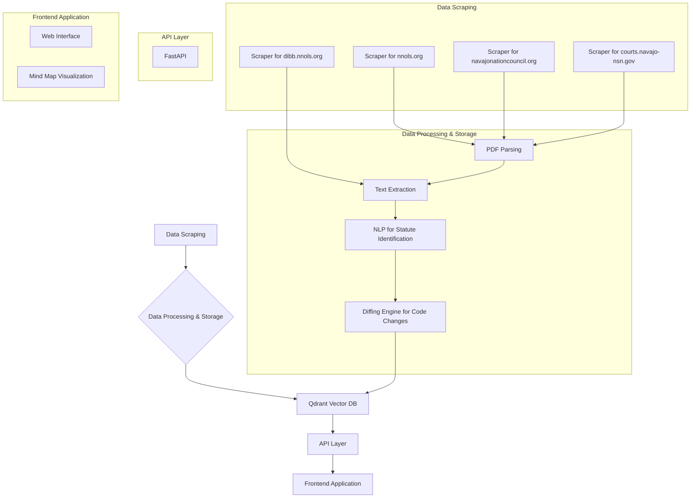

# Project Plan: Navajo Nation Governance Tracker

## 1. Project Overview

The goal of this project is to create a "Navajo Nation Governance Tracker". This tool will provide a comprehensive, up-to-date, and easily accessible platform for tracking the legislative and judicial activities of the Navajo Nation government. It will serve as a "living" version of the Navajo Nation Code, a bill and council tracker, and a repository of judicial decisions.

## 2. Key Features

*   **Living Code:** A version of the Navajo Nation Code that is continuously updated with the latest amendments.
*   **Bill & Council Tracker:** A system to track bills, resolutions, and the activities of council members.
*   **Judicial Branch Component:** A database of Supreme Court opinions, linked to the specific statutes they interpret.
*   **Mind Map:** A graphical representation of the relationships between delegates, bills, committees, and court cases.

## 3. Data Sources

Based on the feasibility study in `docs/poc2.md` and the verification of the URLs, the following data sources will be used:

*   **Base Code:** [http://nnols.org/navajo-nation-code](http://nnols.org/navajo-nation-code) (Machine-readable PDFs)
*   **Amendments:** [http://nnols.org/navajo-nation-code/amendments/](http://nnols.org/navajo-nation-code/amendments/) (Summary page with links to PDFs)
*   **Bills & Resolutions:** [http://navajonationcouncil.org](http://navajonationcouncil.org) (Primary source for full-text PDFs)
*   **Legislative Metadata:** [http://dibb.nnols.org](http://dibb.nnols.org) (Sponsors, status, history)
*   **Council Member Data:** [http://navajonationcouncil.org/council/](http://navajonationcouncil.org/council/) (Official roster, to be supplemented with other sources)
*   **Supreme Court Opinions:** [http://courts.navajo-nsn.gov/supreme-court-opinions/](http://courts.navajo-nsn.gov/supreme-court-opinions/) (Machine-readable PDFs)

## 4. Technical Architecture

## 5. Tools and Technologies

*   **Web Scraping:** Playwright with pytest-playwright
*   **Backend Framework:** FastAPI
*   **Database:** Qdrant (Vector Database) with a local SQLite DB for development.
*   **AI/NLP:** Google GenAI (gemini-2.5-flash-preview-04-17)
*   **Package Manager:** PDM

## 6. Implementation Plan

**Phase 1: Data Acquisition (Scraping)**

*   Develop scrapers for each of the identified data sources.
*   The scrapers will need to be robust and handle various document formats (HTML, PDF).
*   The scrapers will run on a regular schedule to keep the data up-to-date.

**Phase 2: Data Processing and Storage**

*   Implement a pipeline to process the scraped data.
*   This will involve parsing PDFs, extracting text, and identifying key information (e.g., statutes, resolutions, case citations).
*   A graph database (Neo4j is recommended) will be used to store the data and the relationships between different entities.

**Phase 3: Backend Development (API)**

*   Develop a REST API using FastAPI to provide access to the data in the graph database.
*   The API will have endpoints for querying the "living code", tracking bills, and accessing court opinions.

**Phase 4: Frontend Development**

*   Create a user-friendly web interface for the Governance Tracker.
*   The interface will include a "Mind Map" visualization to explore the relationships in the data.

**Phase 5: Deployment and Maintenance**

*   Deploy the application to a cloud platform.
*   Establish a process for monitoring the scrapers and ensuring the data remains accurate and up-to-date.

## 7. Coding Style and Principles

*   **Decoupled Architecture:** The project will follow a decoupled design, with clear separation of concerns between different components.
*   **Modular Design:** We will use a modular approach to organize the codebase, promoting reusability and maintainability.
*   **KISS (Keep It Simple, Stupid):** We will adhere to the KISS principle, favoring simple and straightforward solutions over complex ones.
*   **Standard Library Preference:** We will prioritize the use of Python's standard library wherever possible.
*   **Modern Python Practices:**
    *   Avoid the use of `__init__.py` files for namespace packages.
    *   Use `subprocess` and `pathlib` instead of `os.sys`.
*   **Asynchronous Programming:** We will leverage `asyncio` and threading for concurrent operations, particularly in the web scraping and data processing stages.
*   **Docstrings:** All functions, classes, and modules will be documented with docstrings to facilitate automatic documentation generation.

## 8. Cross-Cutting Concerns

*   **Configuration:** A centralized configuration system will be implemented, using the `config.toml` file to manage application settings.
*   **Logging:** A centralized logging system will be set up to ensure consistent and effective logging throughout the application for debugging and monitoring purposes.